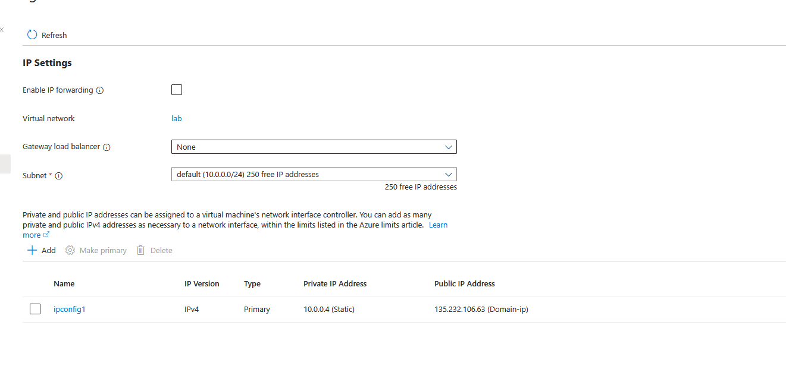

<h1>Network Security Groups (NSGs)</h1>
In this tutorial, we go through the basics of network security groups and how to set them up 

<h2>Environments and Technologies Used</h2>

- Microsoft Azure (Virtual Machines/Compute)
- Remote Desktop
- Various Command-Line Tools
- Various Network Protocols (SSH, RDH, DNS, HTTP/S, ICMP)
- Wireshark (Protocol Analyzer)

<h2>Operating Systems Used </h2>

- Windows 10 (21H2)
- Ubuntu Server 20.04

<h2>High-Level Steps</h2>

- Step 1 create domain controller and virtual machine onto the same subnet and set the domain conmtrollers private ip to static
- Step 2 set the vm to have the domain controllers private ip as its dns 
- Step 3 install active directory domain services and setup a new forest 
- Step 4 creat an OU for employees, admins, and clients

<h2>Actions and Observations</h2>

a

 

